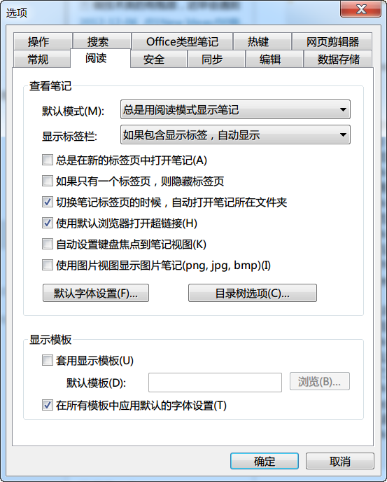
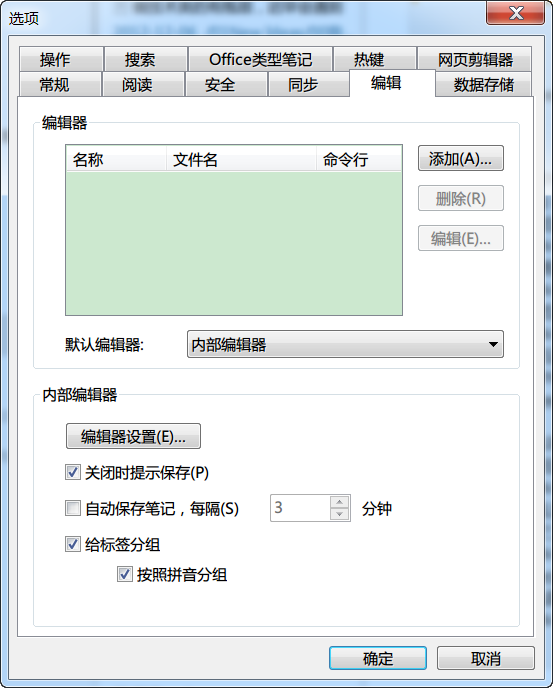
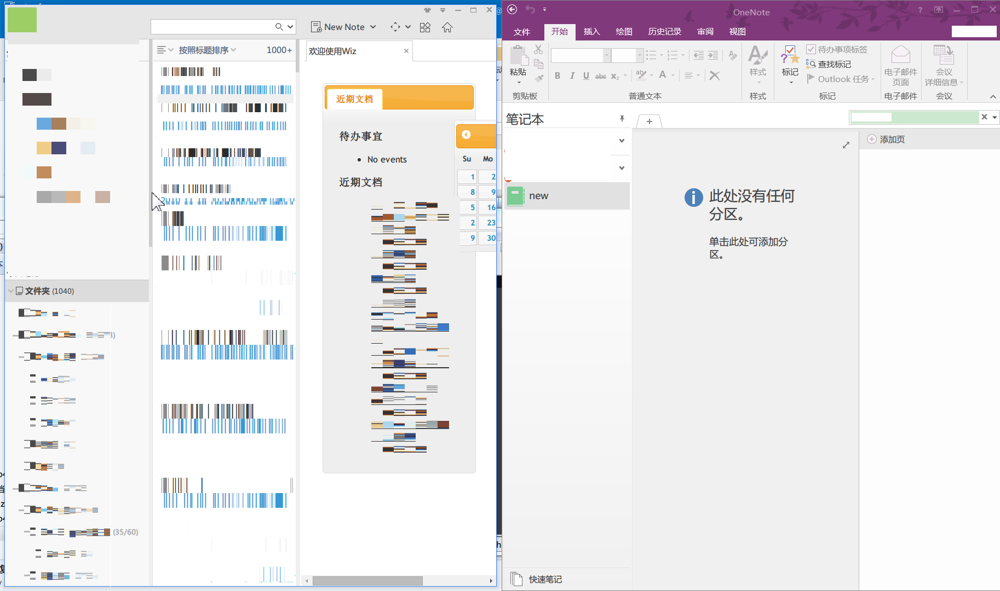

功能说明
========

把为知笔记中的文字/图片内容复制到OneNote中，支持批量迁移，支持迁移后统计，支持断点。

特点：

1、设置好位置后，全程自动，不再通过印象笔记进行手动转换。

2、统计迁移的笔记数量，方便对照迁移的笔记数目。

3、任意时刻均可停止，下次迁移时需要从文件夹下重新迁移，支持从任意文件夹进行。

4、支持自定义配置延迟时间。

5、暂不支持附件处理

注意事项：（前置要求）

文件夹名称不能有OneNote分页不支持的字符

文件夹下的笔记名称不能有重名

映射关系为
````

 为知笔记——OneNote

   文件夹——分页

     笔记——页面
````

最终效果：

为知笔记中显示是什么样，在OneNote中 就会显示什么样。

测试结果

在Windows 7，Windows 10，OneNote 2016下迁移1000条为知笔记，其中文件夹中包含100+笔记，含有2篇10W行的笔记，测试通过。


使用说明
========

**前提要求：**
请用户先做好为知笔记的备份。

把为知笔记的所有目录全部展开，可以使用 快捷键 Ctrl+1

程序使用快捷键Ctrl+F1（启动） 和 Ctrl+F2（停止），请不要使用其他的软件绑定此快捷键。

程序需要使用剪贴板，请暂时退出其他剪贴板管理程序（如Ditto，ArsClip，ClipX等）节约复制的时间。

如果有内容比较多的笔记，请适当调节延迟时间。如果电脑性能不佳，请适当增加延迟时间。

为知笔记中设置如图





推荐给onenote新建一个本地笔记本，删除掉其中的分区。

为知笔记中鼠标先单击**文件夹**，使其处于激活状态，然后把鼠标指针放置在笔记本的滚动条上

窗口布置如图所示，**请注意鼠标指针的位置，必须要放在滚动条上，否则文件夹过多时，切换文件夹会失败。**

**配置文件config.ini说明：延迟时间单位 毫秒**

\[Section\]

;每一个窗口切换后的延迟

common\_delay=300

;粘贴到onenote时的延迟，如果单篇笔记内容很多，请适当增大

paste\_to\_onenote=6000

;为知笔记编辑时（按F4时）的延迟，如果单篇笔记内容很多，请适当增大

edit\_in\_wiznote=2000

;为知笔记切换文件夹时的延迟。如果一个文件夹下笔记内容很多，会来不及切换文件夹，程序就会认为已经迁移完成

switch\_folder\_wiznote=2000

**使用：**

1.执行`WizNote2OneNote.exe`，任务栏托盘处出现图标。
2.按下图设置好鼠标指针后，在键盘上按Ctrl+F1就开始自动执行了
3.按下Ctrl+F2后，过几秒可以停止操作，请多按几次以免无效。


